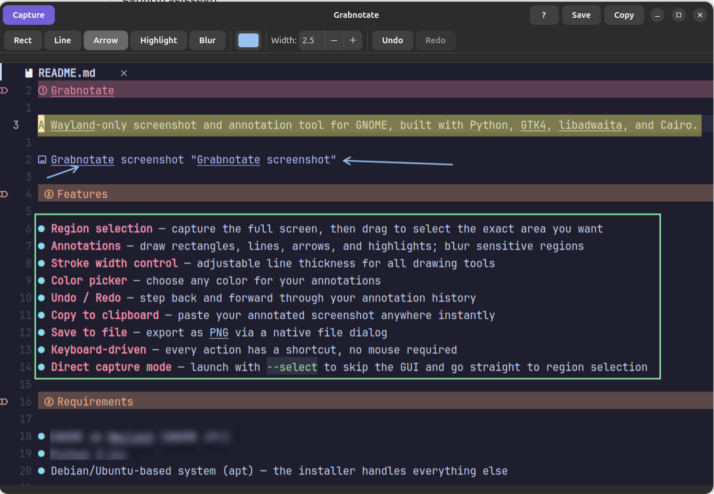

# Grabnotate

A Wayland-only screenshot and annotation tool for GNOME, built with Python, GTK4, libadwaita, and Cairo.



## Features

- **Region selection** — capture the full screen, then drag to select the exact area you want
- **Annotations** — draw rectangles, lines, arrows, and highlights; blur sensitive regions
- **Stroke width control** — adjustable line thickness for all drawing tools
- **Color picker** — choose any color for your annotations
- **Undo / Redo** — step back and forward through your annotation history
- **Copy to clipboard** — paste your annotated screenshot anywhere instantly
- **Save to file** — export as PNG via a native file dialog
- **Keyboard-driven** — every action has a shortcut, no mouse required
- **Direct capture mode** — launch with `--select` to skip the GUI and go straight to region selection

## Requirements

- GNOME on Wayland (GNOME 47+)
- Python 3.14+
- Debian/Ubuntu-based system (apt) — the installer handles everything else

## Installation

```bash
git clone <repo-url>
cd grabnotate
./install.sh
```

`install.sh` will:
1. Install missing system libraries via `apt`
2. Install [uv](https://docs.astral.sh/uv/) if not already present
3. Set up the Python environment (`uv pip install -e .`)
4. Install `~/.local/bin/grabnotate` and `~/.local/bin/grabnotate-select`
5. Optionally register GNOME keyboard shortcuts for both launchers

## Running

```bash
grabnotate              # open main window
grabnotate --select     # go straight to region capture
```

Or without installing:

```bash
uv run grabnotate
uv run grabnotate --select
```

## Usage

### Via the main window
1. Press **Ctrl+Shift+S** or click **Capture**
2. Confirm the GNOME screenshot prompt
3. Adjust the pre-selected region by dragging or using arrow keys
4. Press **Space** to confirm, **Escape** to cancel
5. Annotate using the toolbar tools
6. Press **Ctrl+C** to copy or **Ctrl+S** to save

### Direct capture (recommended for keyboard shortcut)
Assign `grabnotate --select` to a key in GNOME Settings → Keyboard → Custom Shortcuts (or let `install.sh` do it). Pressing the key goes straight to the region selection overlay — no window, no extra step.

## Keyboard Shortcuts

### Main window

| Key | Action |
|---|---|
| `Ctrl+Shift+S` | Take screenshot |
| `R` | Rectangle tool |
| `L` | Line tool |
| `A` | Arrow tool |
| `H` | Highlight tool |
| `B` | Blur tool |
| `C` | Open color picker |
| `Ctrl+Z` | Undo |
| `Ctrl+Shift+Z` | Redo |
| `Ctrl+C` | Copy to clipboard |
| `Ctrl+S` | Save to file |
| `?` / `F1` | Show keyboard shortcuts |

### Region selection overlay

| Key | Action |
|---|---|
| `Space` | Confirm selection |
| `Escape` | Cancel |
| `Arrows` / `hjkl` | Move selection (1 px) |
| `Shift+Arrows` / `Shift+hjkl` | Resize — move bottom-right corner (10 px) |
| `Ctrl+Arrows` / `Ctrl+hjkl` | Resize — move top-left corner (1 px) |

## Architecture

| File | Role |
|---|---|
| `screenshot_tool/app.py` | Application + main window, capture flow, `--select` flag |
| `screenshot_tool/screenshot.py` | Full-screen capture via XDG Desktop Portal |
| `screenshot_tool/overlay.py` | Fullscreen region selection overlay with default selection and arrow key support |
| `screenshot_tool/editor.py` | Cairo annotation canvas |
| `screenshot_tool/toolbox.py` | Annotation toolbar + keyboard shortcuts |
| `install.sh` | Full installer |

## License

MIT
